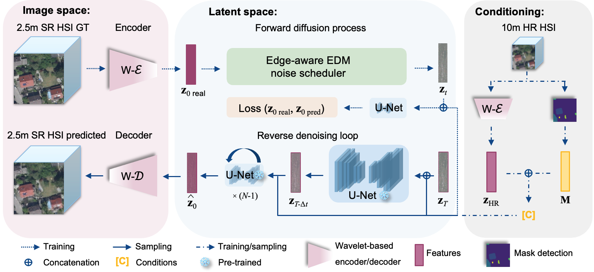
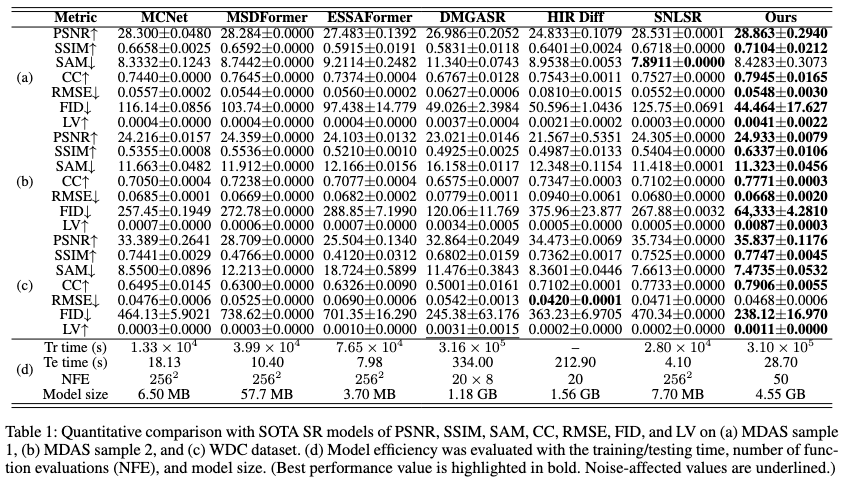

# GEWDiff: Geometric Enhanced Wavelet-based Diffusion Model for Hyperspectral Image Super-resolution

[](https://arxiv.org/abs/2511.07103)

This is the official PyTorch implementation of:

**GEWDiff: Geometric Enhanced Wavelet-based Diffusion Model for Hyperspectral Image Super-resolution**

GEWDiff integrates wavelet-domain frequency decomposition and geometric-aware attention into a diffusion model for high-quality hyperspectral image super-resolution (HSI-SR).

---
## 📰 News
- **2025.11** 🔥 Training dataset and checkpoint released on [huggingface](https://huggingface.co/datasets/zhu-xlab/GEWDiff_training_dataset).
- **2025.11** 🚀 Our paper has been accepted to **AAAI 2026**!
- **2025.11** 📄 Preprint released on [arXiv](https://arxiv.org/abs/2511.07103). 
- **2025.07** 🔥 Code and models are publicly available. 
  
## 🛠️ Environment Setup

**Recommended:**
- Python >= 3.8
- PyTorch >= 2.0

### Installation

```bash
git clone [https://anonymous.4open.science/r/gewdiff.git]
cd GEWDiff

# (Optional) Create a virtual environment
python -m venv venv
source venv/bin/activate  # or venv\Scripts\activate on Windows

# Install dependencies
pip install -r requirements.txt
```

---
## Overview
Our GEWDiff framework combines wavelet decomposition with diffusion models:


*Figure 1: Overall architecture of GEWDiff.*

---
## 📂 Dataset Preparation

Supported datasets:
- MDAS
- EnMap champion
- 400-2500 nm 256x256xchannels hypersepctral image with 5-10 m resolution

### Directory format

```
checkpoints/
│   ├── epoch_200.pth
data/
│   ├── dataset.py
│   ├── process_mask_edge.ipynb
model/
│   ├── edm.py
│   ├── RWT.py
│   ├── unet3d.py
utils/
│   ├── eval.py
│   ├── modelparameters.mat
-------
├── train.py
├── test.py
├── test_wdc.py
├── test_enmap.py
├── requirements.txt
```

Each `.tif` file should contain a hyperspectral image cube.

> You may use `data/process_mask_edge.ipynb` to process mask and edge of each hyperspectral patch.
> Please change every path to your own path in each python files.
---

## 🏋️ Training

### Traning file: `GEWDiff/train.py`

```training information
model:
  name: GEWDiff
  wavelet_level: 1
  latent_channels: 20
  gpu_numbers: 4
  num_steps: 50

training:
  gpu_numbers: 4
  epochs: 200
  batch_size: 1
  lr: 1e-4
  optimizer: AdamW

dataset:
  name: EnMap champion & MDAS
  scale: 4
  patch_size: 256x256
  recall_from_model: true
```

### Train the model

```bash
accelerate launch --multi_gpu --num_processes 4 --mixed_precision=fp16 GEWDiff/train.py --compack_bands 121 --pca_bands 20 --train_batch_size 1 --timesteps 50 --num_epochs 200 --mask True --edge True  --l1_lambda 0.8 --l2_lambda 0.1 --l3_lambda 0.1 --recall 0

```

---

## 🧪 Testing with Pretrained Checkpoint

1. Download a pretrained checkpoint (e.g., `epoch_200.pth`) and place it in `checkpoints/`. Checkpoint and dataset released on [huggingface](https://huggingface.co/datasets/zhu-xlab/GEWDiff_training_dataset).

2. Run the test script:

```bash
accelerate launch --multi_gpu --num_processes 4 --mixed_precision=fp16 GEWDiff/test.py --compack_bands 121 --pca_bands 20 --train_batch_size 1 --timesteps 50 --num_epochs 200 --mask True --edge True  --l1_lambda 0.8 --l2_lambda 0.1 --l3_lambda 0.1 --sigma_min 0.002 --sigma_max 80 --sigma_data 0.5 --rho 0.6
accelerate launch --multi_gpu --num_processes 4 --mixed_precision=fp16 GEWDiff/test_wdc.py --compack_bands 121 --pca_bands 20 --train_batch_size 1 --timesteps 50 --num_epochs 200 --mask True --edge True  --l1_lambda 0.8 --l2_lambda 0.1 --l3_lambda 0.1 --sigma_min 0.2 --sigma_max 90 --sigma_data 0.5 --rho 0.7
accelerate launch --multi_gpu --num_processes 4 --mixed_precision=fp16 GEWDiff/test_enmap.py --compack_bands 121 --pca_bands 20 --train_batch_size 1 --timesteps 50 --num_epochs 200 --mask True --edge True  --l1_lambda 0.8 --l2_lambda 0.1 --l3_lambda 0.1 --sigma_min 0.2 --sigma_max 80 --sigma_data 0.5 --rho 0.7

```
---

## ⚙️ Hyperparameter Options

| Parameter         | Description                      | Recommended Values                    |
|-------------------|----------------------------------|---------------------------------------|
| `num_processes`   | Number of GPU                    | 1/2/3/4                               |
| `compack_bands`   | Compacted bands after WT         | 121                                   |
| `pca_bands`       | Compacted bands after PCA        | 20(only work on training)             |
| `train_batch_size`| Patch size for training          | 1(only work on training)              |
| `timesteps`       | Diffusion sampling steps         | 50 (30 – 100) (only work on testing)  |
| `num_epochs`      | Learning rate                    | 200 (only work on training)           |
| `mask`            | Use mask conditioning or not     | true / false                          |
| `edge`            | Use edge perturbation or not     | true(only work on training)           |
| `l1_lambda`       | Weight for pixel loss            | 0.8(only work on training)            |
| `l2_lambda`       | Weight for perceptual loss       | 0.1(only work on training)            |
| `l3_lambda`       | Weight for gradient loss         | 0.1(only work on training)            |
| `sigma_min`       | end noise                        | 0.002-0.2 (only work on testing)      |
| `sigma_max`       | initial noise                    | 80-90 (only work on testing)          |
| `sigma_data`      | sigma data                       | 0.5 (only work on testing)            |
| `rho`             | sampling path index              | 0.6-0.7 (only work on testing)        |
| `recall`          | recall training epoch            | 0-200 (only work on training)         |

> We encourage users to play with the paramters `sigma_min`, `sigma_max`, `rho` with our provided model checkpoint to get better result on different datasets. This doesn't require training.
---

## 📊 Results
Qualitative comparison with other methods:


*Figure 2: Super-resolution results.*

---

## 📄 Citation

```bibtex
@article{Wang_He_Andreo_Zhu_2026,
title={GEWDiff: Geometric Enhanced Wavelet-based Diffusion Model for Hyperspectral Image Super-resolution},
volume={40},
url={https://ojs.aaai.org/index.php/AAAI/article/view/37978},
DOI={10.1609/aaai.v40i12.37978},
number={12},
journal={Proceedings of the AAAI Conference on Artificial Intelligence},
author={Wang, Sirui and He, Jiang and Andreo, Natàlia Blasco and Zhu, Xiao Xiang},
year={2026},
month={Mar.},
pages={10109-10117} }
```

---

## 📬 Contact

```
sirui.wang@tum.de
xiaoxiang.zhu@tum.de
---
